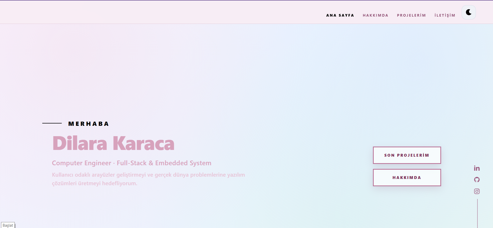
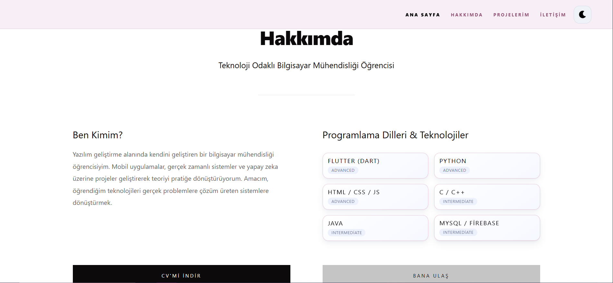
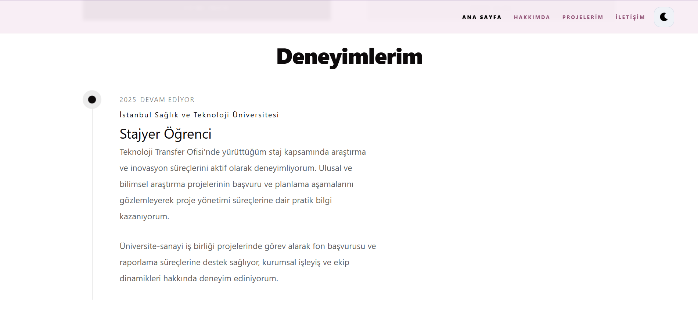
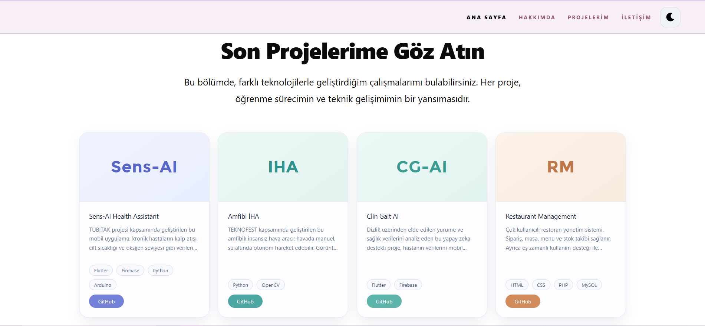
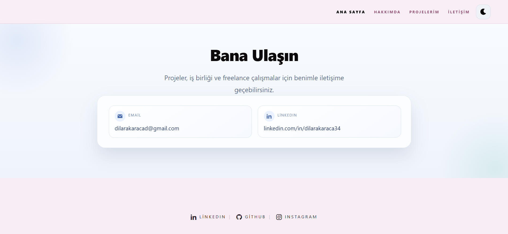

# Kişisel Portfolyo Projesi

Bu proje, yazılım geliştirme becerilerimi, projelerimi ve teknik yetkinliklerimi sergilemek amacıyla geliştirdiğim kişisel portfolyo web sitesidir. Modern tasarım yaklaşımı, responsive arayüz ve kullanıcı odaklı bir yapı ile hazırlanmıştır.

## Canlı Demo

Canlı site: [https://dilara-karaca.netlify.app/](https://dilara-karaca.netlify.app/)

## Proje Özellikleri

- Kişisel tanıtım bölümü
- Projeler ve kullanılan teknolojiler
- Yetenekler ve teknik beceriler
- Deneyim bölümü
- İletişim alanı
- Responsive tasarım
- Netlify üzerinde statik yayın desteği

## Ekran Görüntüleri











## Kullanılan Teknolojiler

- ASP.NET Core MVC
- HTML5
- CSS3
- JavaScript
- Bootstrap
- Netlify

## Proje Yapısı

- `Controllers/` - Uygulama kontrol katmanı
- `Models/` - Veri modelleri
- `Views/` - Razor view dosyaları
- `ViewComponents/` - Sayfa bileşenleri
- `wwwroot/` - Statik dosyalar, CSS, JavaScript, görseller ve Netlify için statik `index.html`
- `screenshots/` - README içinde gösterilecek proje ekran görüntüleri

## Yerelde Çalıştırma

ASP.NET Core MVC uygulamasını yerelde çalıştırmak için:

```bash
dotnet run
```

## Amaç

Bu proje ile:

- Gerçek bir portfolyo uygulaması oluşturmak
- ASP.NET Core MVC mimarisini kullanmak
- Frontend ve backend geliştirme becerilerimi sergilemek
- Projelerimi erişilebilir ve düzenli bir arayüzle sunmak

## Not

Proje aktif olarak geliştirilmektedir ve yeni özellikler eklenmeye devam etmektedir.
